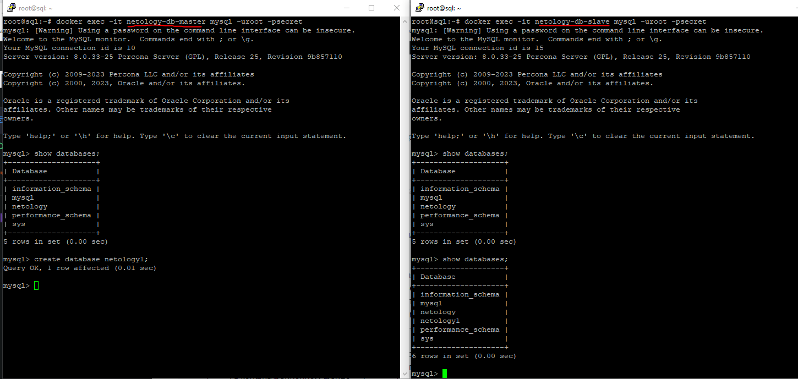

# Домашнее задание к занятию «Репликация и масштабирование. Часть 1»

### Инструкция по выполнению домашнего задания

1. Сделайте fork [репозитория c шаблоном решения](https://github.com/netology-code/sys-pattern-homework) к себе в Github и переименуйте его по названию или номеру занятия, например, https://github.com/имя-вашего-репозитория/gitlab-hw или https://github.com/имя-вашего-репозитория/8-03-hw).
2. Выполните клонирование этого репозитория к себе на ПК с помощью команды `git clone`.
3. Выполните домашнее задание и заполните у себя локально этот файл README.md:
   - впишите вверху название занятия и ваши фамилию и имя;
   - в каждом задании добавьте решение в требуемом виде: текст/код/скриншоты/ссылка;
   - для корректного добавления скриншотов воспользуйтесь инструкцией [«Как вставить скриншот в шаблон с решением»](https://github.com/netology-code/sys-pattern-homework/blob/main/screen-instruction.md);
   - при оформлении используйте возможности языка разметки md. Коротко об этом можно посмотреть в [инструкции по MarkDown](https://github.com/netology-code/sys-pattern-homework/blob/main/md-instruction.md).
4. После завершения работы над домашним заданием сделайте коммит (`git commit -m "comment"`) и отправьте его на Github (`git push origin`).
5. Для проверки домашнего задания преподавателем в личном кабинете прикрепите и отправьте ссылку на решение в виде md-файла в вашем Github.
6. Любые вопросы задавайте в чате учебной группы и/или в разделе «Вопросы по заданию» в личном кабинете.

Желаем успехов в выполнении домашнего задания.

---

### Задание 1

На лекции рассматривались режимы репликации master-slave, master-master, опишите их различия.

*Ответить в свободной форме.*

### Ответ:

Режимы репликации, такие как мастер-слэйв и мастер-мастер, используются для создания распределенных баз данных для обеспечения отказоустойчивости и повышения производительности. Вот их основные различия:

Мастер-слэйв (Master-Slave):

- В этом режиме имеется один главный сервер (мастер) и один или несколько вспомогательных серверов (слэйвы).
- Мастер-сервер принимает записи и обновления данных, которые затем реплицируются на слэйв-серверы.
- Чтение данных может выполняться как с мастера, так и с любого слэйв-сервера.
- В случае сбоя мастера, один из слэйв-серверов может быть выбран в качестве нового мастера.
- В обычном режиме репликации задержка между мастером и слэйвами может быть незначительной.

Мастер-мастер (Master-Master):

- В этом режиме имеется несколько главных серверов (мастеров), каждый из которых может принимать записи и обновления данных.
- Все мастер-серверы реплицируют данные друг у друга, обеспечивая симметричную структуру.
- Чтение и запись данных могут выполняться как на любом мастер-сервере, так и на любом другом сервере в группе.
- Если один мастер перестает работать, другие мастеры продолжают принимать записи и работать без простоя.
- Важно обрабатывать возможные конфликты при параллельной записи данных на разных мастер-серверах.

Оба режима репликации имеют свои преимущества и ограничения, и выбор между ними зависит от требований к системе и конкретных сценариев использования. 

---

### Задание 2

Выполните конфигурацию master-slave репликации, примером можно пользоваться из лекции.

*Приложите скриншоты конфигурации, выполнения работы: состояния и режимы работы серверов.*

### Установка docker

```
sudo apt update
sudo apt-get install docker.io docker-compose
```

### Установка контейнеров mysql-серверов

```
#Создаем
nano master.cnf
#Содержимое master.cnf
[mysqld]
server-id=1
binlog_format=ROW
log-bin

#Конфигурация slave
nano slave.cnf
#Содержимое slave.cnf
[mysqld]
server-id=2
binlog_format=ROW
log-bin
```

### Изменения при старте сервера

```
nano master.sql

#Содержимое master.sql
CREATE USER repl@'%' IDENTIFIED WITH mysql_native_password BY 'slavepass';
GRANT replication slave ON *.* TO 'repl'@'%';

#На slave-сервере нужно указать координаты для подключения к master
nano slave.sql
#Содержимое slave.sql
CHANGE MASTER TO MASTER_HOST='netology-db-master', MASTER_USER='repl', MASTER_PASSWORD='slavepass';
```
Создадим файл для docker-compose

```
nano docker-compose.yml

#Содержимое docker-compose.yml
version: '3.7'

services:
    mysql:
        image: 'percona:8.0'
        container_name: netology-db-master
        volumes:
            - ./master.cnf:/etc/my.cnf.d/repl.cnf
            - ./master.sql:/docker-entrypoint-initdb.d/start.sql
        environment:
            MYSQL_ROOT_PASSWORD: "secret"

    mysqlread1:
        image: 'percona:8.0'
        container_name: netology-db-slave
        volumes:
            - ./slave.cnf:/etc/my.cnf.d/repl.cnf
            - ./slave.sql:/docker-entrypoint-initdb.d/start.sql
        depends_on:
            - mysql
        environment:
            MYSQL_ROOT_PASSWORD: "secret"
```
### Запускаем

```
docker-compose rm -vf && docker-compose up
```

### Проверка
Открываем ещё 1 терминал, заходим в master-сервер

```
docker exec -it netology-db-master mysql -uroot -psecret
```

И ещё 1 терминал, заходим в любой slave

```
docker exec -it netology-db-slave mysql -uroot -psecret
```

### Создадим на master базу данных и проверим




